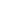
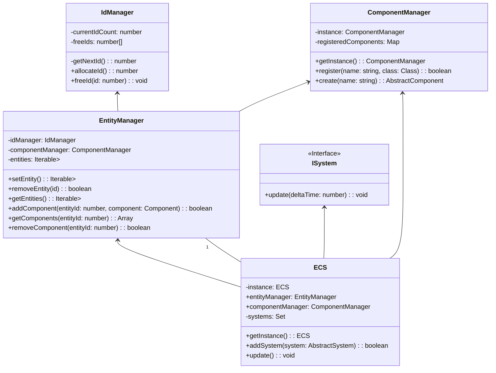

## Bonjour, Je suis Phost, développeur web et concepteur développeur d'application en devenir
je suis actuellement à la recherche d'un stage de 5 mois entre le 8 septembre 2025 et le 16 janvier 2026 dans le cadre de ma formation.
<div style="background-color:#222;padding:16px;border-radius:8px;max-width:820px;">
    <details style="margin-bottom:12px;">
      <summary style="font-size:1.3rem;color:#fff;cursor:pointer;padding:8px 0;">Frameworks</summary>
      <div style="display:flex;gap:18px;align-items:center;flex-wrap:wrap;margin:12px 0 0 0;">
        
        
        
        
      </div>
    </details>
    <details style="margin-bottom:12px;">
      <summary style="font-size:1.3rem;color:#fff;cursor:pointer;padding:8px 0;">Libraries</summary>
      <div style="display:flex;gap:18px;align-items:center;flex-wrap:wrap;margin:12px 0 0 0;">
        
        
        
        
      </div>
    </details>
    <details style="margin-bottom:12px;">
      <summary style="font-size:1.3rem;color:#fff;cursor:pointer;padding:8px 0;">DevOps</summary>
      <div style="display:flex;gap:18px;align-items:center;flex-wrap:wrap;margin:12px 0 0 0;">
        
        
        
      </div>
    </details>
    <details style="margin-bottom:12px;">
      <summary style="font-size:1.3rem;color:#fff;cursor:pointer;padding:8px 0;">Databases</summary>
      <div style="display:flex;gap:18px;align-items:center;flex-wrap:wrap;margin:12px 0 0 0;">
        
        
        
      </div>
    </details>
    <details style="margin-bottom:12px;">
      <summary style="font-size:1.3rem;color:#fff;cursor:pointer;padding:8px 0;">Outils</summary>
      <div style="display:flex;gap:18px;align-items:center;flex-wrap:wrap;margin:12px 0 0 0;">
        
        
        
        
        
        
        
        
      </div>
    </details>
    <details style="margin-bottom:12px;">
      <summary style="font-size:1.3rem;color:#fff;cursor:pointer;padding:8px 0;">Design</summary>
      <div style="display:flex;gap:18px;align-items:center;flex-wrap:wrap;margin:12px 0 0 0;">
        
        
        
      </div>
    </details>
    <details>
      <summary style="font-size:1.3rem;color:#fff;cursor:pointer;padding:8px 0;">Langues &amp; Langages</summary>
      <div style="display:flex;gap:18px;align-items:center;flex-wrap:wrap;margin:12px 0 0 0;color:#fff">
        <span style="font-weight:bold;">Français</span>
        <span style="font-weight:bold;">Anglais</span>
        
        
        
        
        <span style="font-weight:bold;">SQL</span>
        <span style="font-weight:bold;">Java</span>
        
        <span style="font-weight:bold;">C#</span>
        
      </div>
    </details>
</div>


## Stack Technique
```text
│────────────────│   │─────────────────│   │──────────────│   │───────────────│
│  Frameworks    │   │  Libraries      │   │  DevOps      │   │  Databases    │
│────────────────│   │─────────────────│   │──────────────│   │───────────────│
│ ► Next.js      │   │ ► Node.js       │   │ ► Docker     │   │ ► MongoDB     │
│ ► React Native │   │ ► Express       │   │ ► GitLab CI  │   │ ► PostgreSQL  │
│ ► NestJS       │   │ ► React         │   │ ► Apache2    │   │ ► MySQL       │
│ ► Symfony      │   │ ► Tailwind CSS  │   │──────────────│   │───────────────│
│────────────────│   │─────────────────│

│────────────────│   │───────────────────────│    │────────────│
│  Languages     │   │  Tools                │    │  Design    │    
│────────────────│   │───────────────────────│    │────────────│    
│ ► French       │   │ ► Git                 │    │ ► Figma    │    
│ ► English      │   │ ► GitHub              │    │ ► Canva    │    
│ ► Javascript   │   │ ► GitLab              │    │ ► Blender  │    
│ ► TypeScript   │   │ ► Visual Studio Code  │    │────────────│    
│ ► CSS          │   │ ► IntelliJ JetBrains  │    
│ ► HTML         │   │ ► Postman             │
│ ► SQL          │   │ ► Trello              │
│ ► Java         │   │ ► Discord             │
│ ► Kotlin       │   │───────────────────────│
│ ► C#           │
│ ► PHP          │
│────────────────│
```
## 🔭 Je développe sur mon temps libre un moteur de jeu 2d avec architecture ECS


<!-- 
<div align="center">
     
</div>
-->

- 🌱 J'apprend actuellement l'architecture ECS, la méthodologie scrum et devops 
- 👯 Mon objectif final est d'intégrer une équipe en tant qu'architecte logiciel
- 🤔 Je recherche un accompagnement pour m'aider à monter en compétence et je pourrais apporter mon esprit de sorcier aiguisée 
- 📫 Vous pouvez me contacter par mail à l'adresse: cucchiaraquentin@gmail.com
- ⚡ Euhhh ... je sais plus ce que je voulais dire ...
